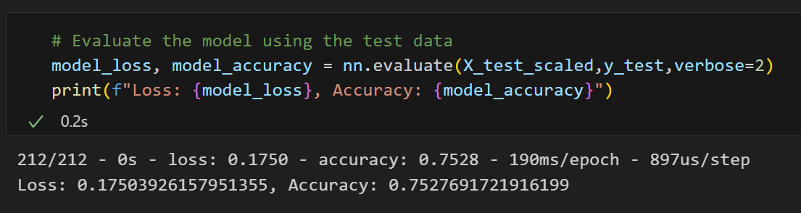

# deep-learning-challenge
Module 21 Challenge

# Premise
In this challenge, I use Machine Learning (specifically a Keras neural network model in Python using tensorflow, sklearn, and pandas), to train and evaluate a model to gauge applicant success if granted funding based on a number of variables. 

# Report

### Analysis Overview
The purpose of this analysis is to use existing data to create a model that will predict success for applicants who may be granted funding, specifically flagging whether the organization was a success or not (binary). Data classes used to predict this include application type, affiliation, classification, use case, organization type, status, income amount, special considerations, and their ask amount. Applicants are given a "successful" of 0 (unsuccessful) or a 1. 

### Results
* Data Processing
    + What variable(s) are the target(s) for your model?
        - IS_SUCCESSFUL
    + What variable(s) are the features for your model?
        - APPLICATION_TYPE, AFFILIATION, CLASSIFICATION, USE_CASE, ORGANIZATION, INCOME_AMT, ASK_AMT
    + What variable(s) should be removed from the input data because they are neither targets nor features?
        - EIN, NAME
* Compiling, Training, and Evaluating the Model
    + How many neurons, layers, and activation functions did you select for your neural network model, and why?
        - 110 neurons across 2 layers using the activation function relu. These were selected because of their balance of accuracy and efficiency. 
    + Were you able to achieve the target model performance?
        - Yes, I was able to achieve 75% after optimizations.
    + What steps did you take in your attempts to increase model performance?
        - The number one thing that I did was realize that outliers in the ASK_AMT variable were the biggest problems for the model. Concentrating the model on lower ask amounts (I settled on limiting the dataset to ask amounts < $25,000, which preserved the majority of the dataset while increasing accuracty) was critical. A different model should be applied for ask amounts much greater than this, maybe looking at more or different variables since the risk is also greater. 
        - Additional things I tried were Increased binning, changing the number of neurons used, changed the optimizer, updated the number of epochs, and changed the loss compiler. 

### Summary

The model performed well, but 75% is a pretty low bar considering the ask amounts given in the data (some in the billions of dollars), and thus I'd aim for a better model. Some ideas to get a better predictive model moving forward:
* Low stakes ($25,000 requests and under) and high stakes ($25,000+) requests need different modeling
* Additional data is necessary for high stakes requests. Some ideas include revenue in addition to income, cash on hand, etc.
* Additional research into different modeling functions and techniques beyond the scope of this project. 

# References
* Sklearn documentation: https://scikit-learn.org/stable/modules/generated/sklearn.linear_model.LogisticRegression.html
* ChatGPT (https://chat.openai.com/) for select coding assitance.
* Tensorflow documentation: https://www.tensorflow.org/learn

